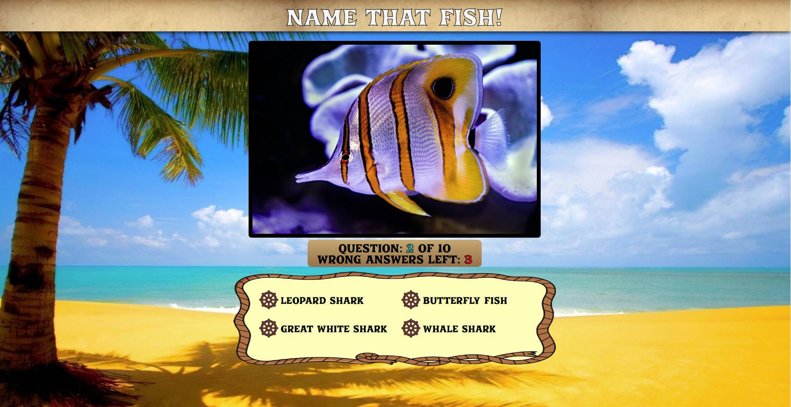

# Name That Fish
A fun quiz game that tests your knowledge of our piscene pals!
Built in two days for the Mintbean Svelte.js hackathon challenge. Inspired by the ways we used to waste time at troop meetings in Boy Scout Troop 476.

### [Try it now!](https://stickmanbob.github.io/svelteQuizGame/)

## Overview
The game tests your knowledge of fish by asking you to correctly identify a fish by looking at a picture and selecting the correct option.

There are 10 questions total for each attempt, but more than 10 seeds, meaning the questions will be different each time. You can miss up to three fish before you lose the game and must start over. Win the game by making it to the end without being eliminated!

## Technologies

This applet was built using **[Svelte.js](https://svelte.dev/)**. Svelte is a powerful new frontend framework that allows for the use of component based design and reactivity, but without a virtual DOM. Svelte compiles all your components into a single .js file that can then be included into an HTML document, making it very lightweight and fast compared to heavier frameworks like React.

